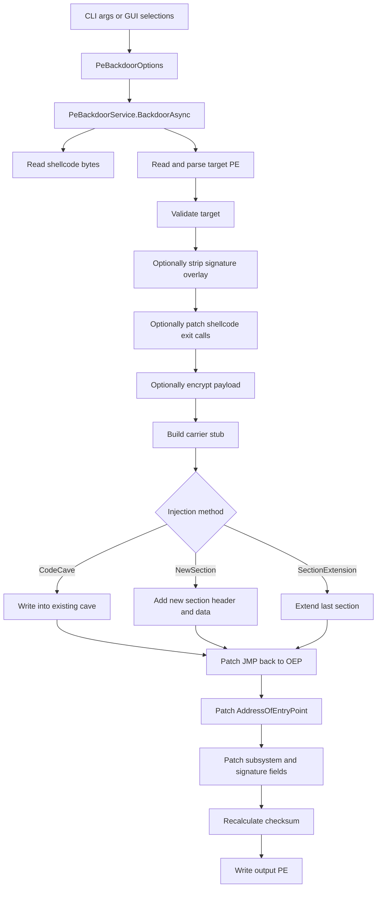
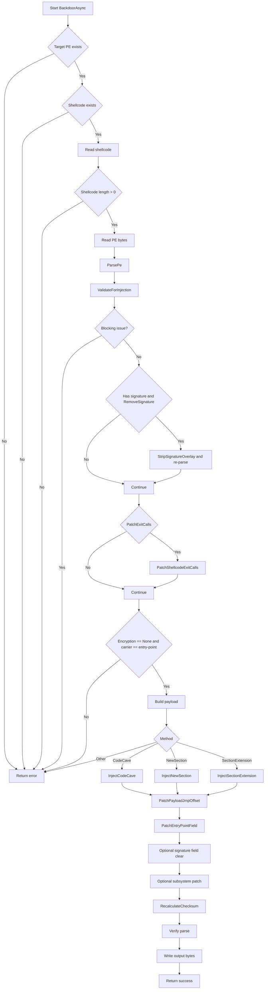
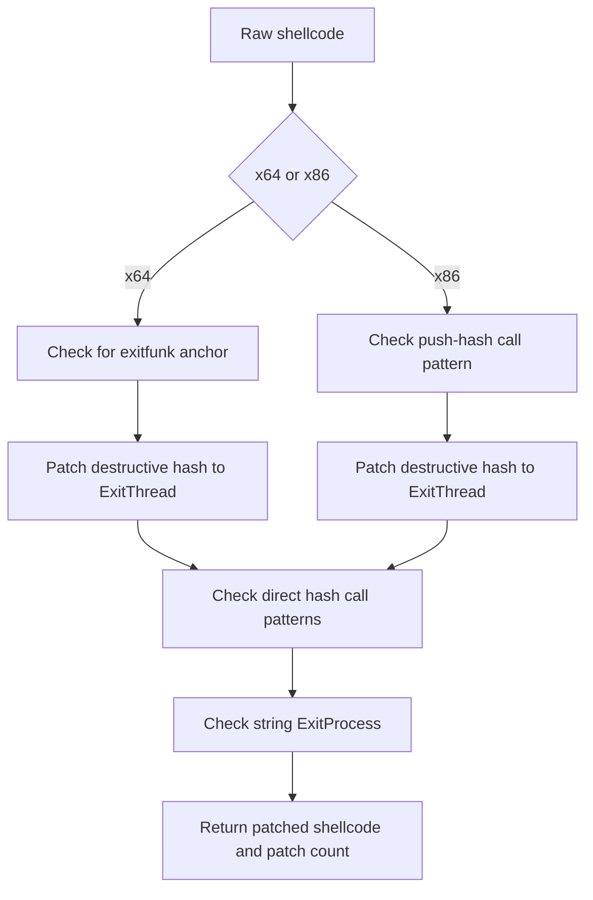

# Washmachine PE Backdoorer Workflow Guide

This document explains how the Washmachine PE backdoorer works today, end to end, from CLI input to output PE patching.

It is based on the current implementation in:

- `Washmachine.Core\Services\PeBackdoorService.cs`
- `Washmachine.Core\Models\PeBackdoorModels.cs`
- `Washmachine.Cli\Program.cs`
- `Views\BackdooringPage.xaml.cs`
- `Views\CompilePage.xaml.cs`

Use this guide as the implementation reference for the current codebase, not as a generic PE injection tutorial.

For safety and legality, only use this workflow in environments you own or are explicitly authorized to assess.

---

## Table of Contents

- [1. What the backdoorer does](#1-what-the-backdoorer-does)
- [2. Main files and responsibilities](#2-main-files-and-responsibilities)
- [3. High-level architecture](#3-high-level-architecture)
- [4. Core data model](#4-core-data-model)
- [5. End-to-end workflow in `BackdoorAsync`](#5-end-to-end-workflow-in-backdoorasync)
- [6. PE parsing internals](#6-pe-parsing-internals)
- [7. Code cave discovery](#7-code-cave-discovery)
- [8. Payload construction](#8-payload-construction)
- [9. Exit patching for thread-safe shellcode](#9-exit-patching-for-thread-safe-shellcode)
- [10. Injection methods](#10-injection-methods)
- [11. Header patching and file finalization](#11-header-patching-and-file-finalization)
- [12. CLI workflow](#12-cli-workflow)
- [13. Programmatic usage from C#](#13-programmatic-usage-from-c)
- [14. Result model and JSON output](#14-result-model-and-json-output)
- [15. What is fully implemented vs partially wired](#15-what-is-fully-implemented-vs-partially-wired)
- [16. Shellcode compatibility rules](#16-shellcode-compatibility-rules)
- [17. Troubleshooting guide](#17-troubleshooting-guide)
- [18. Design notes and extension points](#18-design-notes-and-extension-points)
- [19. Practical workflow checklist](#19-practical-workflow-checklist)

---

## 1. What the backdoorer does

Washmachine's backdoorer takes:

1. A target PE file (`.exe` or `.dll`)
2. A raw shellcode blob (`.bin`)
3. A set of injection options

It then:

1. Parses the PE structure
2. Validates whether the target looks injectable
3. Optionally strips a digital-signature overlay
4. Optionally patches destructive shellcode exit behavior
5. Builds a carrier stub around the shellcode
6. Places that payload into the PE using one of several storage methods
7. Patches the PE entry point to start at the injected payload
8. Returns control to the original entry point after launch
9. Recalculates checksum and writes the modified PE

At a high level, the design goal is:

- keep the host program alive
- preserve original execution after payload launch
- support common x64 shellcode reliably
- work against existing native PE files without recompiling them

The most important recent reliability feature is automatic patching of destructive shellcode exit routines, especially common Metasploit `EXITFUNC` patterns, so that the shellcode exits its own thread instead of killing the host process.

---

## 2. Main files and responsibilities

| File | Responsibility |
| --- | --- |
| `Washmachine.Core\Services\PeBackdoorService.cs` | Core PE parsing, payload building, injection, header patching, checksum recalculation |
| `Washmachine.Core\Models\PeBackdoorModels.cs` | Option enums, request/response models, PE metadata models |
| `Washmachine.Cli\Program.cs` | CLI parsing, REPL submode, pre-flight display, JSON output, help text |
| `Views\BackdooringPage.xaml.cs` | GUI option selection for backdooring |
| `Views\CompilePage.xaml.cs` | GUI path that can emit the CLI backdoor command string |
| `Washmachine.Core\Services\PeAnalyzerService.cs` | Rich PE analysis used by the CLI for display and feasibility reporting |

---

## 3. High-level architecture

There are two front ends and one shared engine:

- CLI front end
- WinUI front end
- shared core service

Only the core service actually edits the PE.



There is a second analysis-only path in the CLI:

- `AnalyzePeAsync` gives basic PE metadata
- `PeAnalyzerService.AnalyzeAsync` provides richer analysis for display
- `FindCodeCavesAsync` scans and displays candidate caves before actual injection

That CLI analysis path is for operator visibility. The actual mutation path is `BackdoorAsync`.

---

## 4. Core data model

### `PeBackdoorOptions`

This is the request object used by the core service.

Important fields:

| Property | Meaning |
| --- | --- |
| `TargetPePath` | Path to the PE being modified |
| `ShellcodePath` | Path to the raw `.bin` shellcode |
| `OutputPath` | Explicit output path, or empty for auto-generated default |
| `Method` | Injection storage strategy |
| `CarrierInvoke` | Parsed option; the active backdoor path supports entry-point hijack only |
| `Encryption` | Parsed option; the active backdoor path requires `None` |
| `XorKey` | XOR key when `Encryption == Xor` |
| `MinCaveSize` | Exposed option; currently not enforced by the final code-cave injector |
| `DryRun` | Exposed in the model, but current dry-run behavior is handled in the CLI before the core service is called |
| `PreserveOriginalEntry` | Parsed option; the active backdoor path currently requires OEP preservation |
| `PatchIat` | Exposed option; current core path does not implement IAT patching |
| `RemoveSignature` | Strip or clear PE signature data |
| `PatchSubsystemToGui` | Force GUI subsystem |
| `NewSectionName` | Name for the new section in `NewSection` mode |
| `PatchExitCalls` | Patch destructive shellcode exit calls to `ExitThread` |
| `DllExportName` | Placeholder for DLL-export targeting; not currently consumed by the core path |

### Enums

#### `InjectionMethod`

Declared values:

- `CodeCave`
- `NewSection`
- `TextSectionPadding`
- `SectionExtension`
- `TlsCallback`

Currently implemented in the core service:

- `CodeCave`
- `NewSection`
- `SectionExtension`

#### `CarrierInvoke`

Declared values:

- `EntryPointHijack`
- `EntryFunctionBackdoor`
- `TlsCallback`
- `DllMain`
- `DllExport`

Current core behavior is effectively `EntryPointHijack`.

#### `PayloadEncryption`

Declared values:

- `None`
- `Xor`
- `Xor2`
- `Rc4`

These enum values still exist in the model for compatibility, but the hardened backdoor path now requires `PayloadEncryption.None`. See [15. What is fully implemented vs partially wired](#15-what-is-fully-implemented-vs-partially-wired).

### `BackdoorResult`

This is the service response object.

Important fields:

| Property | Meaning |
| --- | --- |
| `Success` | Whether the operation completed |
| `OutputPath` | Output PE path |
| `ErrorMessage` | Failure reason if `Success == false` |
| `ShellcodeAddress` | RVA where the payload begins |
| `CarrierAddress` | Currently set to the same RVA as `ShellcodeAddress` |
| `ShellcodeSize` | Original shellcode byte count |
| `CarrierSize` | Declared but not currently populated in the core path |
| `Warnings` | Non-fatal issues |
| `Steps` | Human-readable action log |

---

## 5. End-to-end workflow in `BackdoorAsync`

The method `PeBackdoorService.BackdoorAsync` is the canonical backdooring pipeline.

### Step-by-step summary

1. Validate input paths
2. Read shellcode and reject empty payloads
3. Read target PE and parse it
4. Run pre-flight validation
5. Strip signature overlay if needed
6. Patch destructive exit calls if enabled
7. Reject unsupported in-place encryption and carrier combinations
8. Build a carrier payload
9. Inject that payload
10. Patch the payload's return jump
11. Patch the PE entry point
12. Clear signature directory if needed
13. Patch subsystem if needed
14. Recalculate checksum
15. Re-parse for sanity checking
16. Write output file

### Detailed flowchart



### Why the order matters

The order is deliberate:

- signature overlay must be stripped before `new-section` or `section-extension`, otherwise appended bytes can overlap the existing overlay
- exit patching happens before encryption so pattern matching works on plaintext shellcode
- the payload's final `JMP` back to the original entry point cannot be patched until the payload has an actual RVA
- checksum must be done after every mutation is complete

### Validation rules used by `ValidateForInjection`

The validator currently enforces or reports the following conditions:

| Check | Severity | Meaning |
| --- | --- | --- |
| Target is a `.NET` assembly | Block | Native binary patching is rejected |
| `AddressOfEntryPoint == 0` | Block | No valid start address exists |
| `NumberOfSections == 0` | Block | The PE is structurally unusable for this workflow |
| OEP does not map to a valid file offset | Block | Raw patching cannot be done safely |
| PE has a signature and signature removal is disabled | Warning | The signature will be invalid after mutation |
| Target is a DLL and entry-point hijack is selected | Warning | DllMain behavior may be altered |
| Shellcode is larger than 1 MB | Warning | Cave-based injection becomes less realistic |
| Code-cave mode selected but no obviously large section exists | Warning | Suggests switching to `new-section` |

### Important note on validation heuristics

The validation layer uses quick heuristics, not the final built-payload size.

That means:

- a dry-run or pre-flight screen can look feasible
- but the final built carrier plus shellcode may still exceed the best cave

The final source of truth is the actual built payload length used by `InjectCodeCave`.

---

## 6. PE parsing internals

The method `ParsePe` does the low-level parsing work. It reads enough of the PE to support mutation, not a full-blown loader-grade model.

### Parsed fields

The parser extracts:

- DOS signature (`MZ`)
- PE header offset from `e_lfanew`
- NT signature (`PE\0\0`)
- machine type
- section count
- optional-header size
- DLL characteristics
- entry point RVA
- image base
- section alignment
- file alignment
- size of image
- size of headers
- checksum field location
- subsystem field location
- security directory location
- section headers

It also computes the file offsets of patchable fields such as:

- `NumberOfSections`
- `AddressOfEntryPoint`
- `SizeOfImage`
- `CheckSum`
- `Subsystem`
- security directory entry
- each section header

This is important because PE patching must happen at raw file offsets, not RVAs.

### .NET detection

The parser checks the COM descriptor data directory to determine whether the target is a managed assembly.

If it is, the injector blocks the operation because a native binary patch would likely corrupt managed metadata or invalidate CLR assumptions.

### Signature detection

Authenticode is identified through the security data directory:

- index 4 in the data-directory table
- special case: this directory stores a raw file offset, not an RVA

That detail matters because the signature data sits after the last section, not inside the mapped PE image.

### Entry-point mapping

The parser resolves the original entry-point RVA to a file offset with `RvaToFileOffset`.

If it cannot map the entry point to a valid raw offset, injection is blocked.

---

## 7. Code cave discovery

The method `ScanForCaves` searches each section for long runs of:

- `0x00`
- `0xCC`

These bytes usually represent padding, alignment slack, or unused raw space.

### Cave scanning behavior

For each section:

1. Skip sections with zero raw size
2. Walk the raw bytes from `RawAddress` to `RawAddress + RawSize`
3. Start a cave when a `0x00` or `0xCC` byte is found
4. Extend the cave while the fill pattern remains compatible
5. Flush the cave if the sequence ends and it meets the minimum size

Each discovered cave records:

- section name
- section index
- file offset
- RVA
- size
- fill byte
- whether the section is executable

The results are sorted by size descending.

### Cave selection for actual injection

`InjectCodeCave` chooses the "best" cave by:

1. preferring executable sections
2. then preferring the largest cave

If the chosen section is not already executable and readable, its characteristics are patched.

### Important nuance

The CLI exposes `--cave-min-size`, and the analysis screen uses it when displaying caves.

However, the current core `InjectCodeCave` path does **not** use `options.MinCaveSize` during final cave selection. It only requires the cave to be large enough for the built payload.

There is also a second nuance: the CLI preview uses a rough cave-space estimate, while the injector uses the actual built payload length. For x64 threaded payloads, the final stub can be noticeably larger than the preview heuristic shown in the analysis screen.

---

## 8. Payload construction

Washmachine builds a carrier stub around the shellcode. The carrier is what:

- preserves process state
- optionally decrypts the shellcode
- launches the shellcode
- restores state
- jumps back to the original entry point

There are two payload builders:

- `BuildInlinePayload`
- `BuildThreadedPayload`

### 8.1 Inline payload

The inline payload layout is:

```text
[save regs] [decoder?] [CALL shellcode] [restore regs] [JMP OEP] [shellcode]
```

This path is used for:

- x86 payloads
- encrypted payloads
- any case where the x64 threaded path is not selected

#### Inline layout details

- `save regs` is architecture-specific
- XOR decoder is inserted only for the x64 single-byte XOR path
- `CALL shellcode` is a relative call into the appended shellcode bytes
- after shellcode returns, registers are restored
- a final relative `JMP` returns execution to the original entry point

### 8.2 x64 threaded payload

The x64 threaded payload exists to make shellcode safer for host processes.

Instead of executing the shellcode directly on the process entry thread, the carrier:

1. preserves registers
2. walks the PEB to find `kernel32.dll`
3. parses the export directory
4. resolves `CreateThread`
5. starts a new thread at the shellcode address
6. restores the original thread state
7. jumps back to the original entry point

Payload layout:

```text
[save regs] [PEB walk] [export parsing] [CreateThread call] [restore regs] [JMP OEP] [shellcode]
```

This path is selected only when:

- the target is x64
- encryption is `None`

### Why `CreateThread` is resolved manually

The threaded stub is position-independent and self-contained. It does not rely on the target's import table.

Instead, it:

- finds `kernel32` through the PEB
- parses the export directory manually
- searches export names for `CreateThread`

That keeps the stub independent of the target application's imports.

### Stack handling in the x64 threaded stub

The x64 stub carefully aligns the stack before calling `CreateThread`.

That is important because Windows x64 requires:

- 16-byte alignment before a call
- 32 bytes of shadow space

The stub:

- saves `rsp` in `rbp`
- aligns `rsp` with `and rsp, -16`
- reserves `0x30` bytes
- writes arguments 5 and 6 on the stack
- calls `CreateThread`
- restores the original `rsp`

### 8.3 Register save and restore stubs

#### x64

The x64 save block pushes:

- general-purpose registers except `rsp`
- `r8` through `r15`
- flags

Then it reserves `0x20` bytes of shadow space.

The restore block reverses that process.

#### x86

The x86 path uses:

- `pushad`
- `pushfd`

and restores with:

- `popfd`
- `popad`

### 8.4 Legacy decoder code paths

The source file still contains older decoder and encryption helpers, but the hardened backdoor path now rejects non-`None` encryption during validation.

So the active runtime behavior is:

1. accept a ready-to-run flat `.bin`
2. patch destructive exits if needed
3. wrap the payload with the carrier
4. inject it

not:

1. encode or encrypt the payload inside the backdoor command
2. emit a runtime decoder

### Payload layout diagram


---

## 9. Exit patching for thread-safe shellcode

This is one of the most important reliability features in the current implementation.

### The problem

Many raw shellcode payloads are not written for "inject into an existing process, then let the original program continue."

Common failure modes:

- the shellcode calls `ExitProcess`
- the shellcode calls `TerminateProcess`
- the shellcode uses a Metasploit `EXITFUNC=seh` pattern that intentionally crashes
- the shellcode assumes the process should end after payload execution

That behavior is fine for a standalone loader but bad for PE backdooring because it kills the host process.

### The fix

Washmachine patches those destructive exits to `ExitThread` where possible.

That lets the injected shellcode thread terminate while the original process survives.

### Patched Metasploit hashes

The implementation includes precomputed Metasploit ROR13 API hashes:

| API | Hash |
| --- | --- |
| `ExitProcess` | `0x56A2B5F0` |
| `ExitThread` | `0x0A2A1DE0` |
| `RtlExitUserThread` | `0x6F721347` |
| `SetUnhandledExceptionFilter` | `0xEA320EFE` |
| `TerminateProcess` | `0x5ECADC87` |
| `NtTerminateProcess` | `0x1E35E09C` |
| `RtlExitUserProcess` | `0xAA1B814D` |
| `GetVersion` | `0x9DBD95A6` |

### Patching strategies

The method `PatchShellcodeExitCalls` uses three strategies.

#### Strategy 1: Metasploit exitfunk block anchor

Pattern:

```text
BB <exit_hash>
41 BA A6 95 BD 9D
FF D5
```

Interpretation:

- `BB <hash>` loads the chosen exit routine hash into `ebx`
- `41 BA A6 95 BD 9D` loads the `GetVersion` hash into `r10d`
- `FF D5` calls the resolver

The patcher anchors on the `GetVersion` hash block and looks backward for the exit hash.

If the exit hash is destructive, it replaces it with the `ExitThread` hash.

#### Strategy 2: Direct API hash calls

For x64 the patcher looks for:

```text
41 BA <hash_le_4> FF D5
```

For x86 the patcher looks for:

```text
68 <hash_le_4> FF D6
68 <hash_le_4> FF D7
```

If the hash is destructive, it is rewritten to the `ExitThread` hash.

#### Strategy 3: String-based patching

Some shellcode resolves APIs by name rather than by hash.

The patcher searches for:

```text
ExitProcess\0
```

and replaces it with the size-neutral:

```text
ExitThread\0\0
```

Both sequences are 12 bytes long, so the patch does not change payload size.

### Exit-patching flowchart



### Why this matters for Metasploit payloads

This directly addresses the classic case where a generated payload works on its own but fails when injected into a host process.

A typical example is `windows/x64/exec` shellcode configured to launch `calc.exe` and then terminate through a destructive exit path. In a PE-backdoor scenario:

- the payload thread may succeed in launching `calc.exe`
- but then it kills or crashes the host process
- the backdoored executable appears "broken"

Patching the exit routine to `ExitThread` is the correct host-preserving fix when the rest of the payload is otherwise compatible.

---

## 10. Injection methods

Washmachine currently implements three actual storage methods.

### Comparison table

| Method | How it stores payload | Strengths | Risks |
| --- | --- | --- | --- |
| `CodeCave` | Reuses unused bytes inside an existing section | Minimal file-structure change | Requires a large enough cave |
| `NewSection` | Adds a fresh executable section | Clean placement, predictable space | Needs room for another section header |
| `SectionExtension` | Appends bytes to the last section and enlarges it | Simple when last section is extendable | Changes section sizes and characteristics |

### 10.1 `CodeCave`

Implementation method: `InjectCodeCave`

Behavior:

1. Scan for caves large enough for the final built payload
2. Choose the best candidate
3. Copy the payload into the raw file bytes at that offset
4. Patch section characteristics if the section is not executable and readable
5. Clear `IMAGE_SCN_MEM_DISCARDABLE` so the loader will not discard the section after initialization

This last step is important. If code is placed into a discardable section and the loader later discards it, the entry point will jump into unmapped or invalid data.

### 10.2 `NewSection`

Implementation method: `InjectNewSection`

Behavior:

1. Check whether there is room in the headers for a new section header
2. Compute aligned RVA and raw offset for the new section
3. Extend the file if needed
4. Write the payload
5. Increment `NumberOfSections`
6. Update `SizeOfImage`
7. Write a new section header

The new section is created with:

- `IMAGE_SCN_MEM_EXECUTE`
- `IMAGE_SCN_MEM_READ`
- `IMAGE_SCN_CNT_CODE`

Section names are taken from `options.NewSectionName` and truncated to 8 bytes.

### 10.3 `SectionExtension`

Implementation method: `InjectSectionExtension`

Behavior:

1. Choose the last section
2. Append the payload immediately after the section's current raw end
3. Increase `RawSize`
4. Increase `VirtualSize`
5. Mark the section executable and readable
6. Clear `IMAGE_SCN_MEM_DISCARDABLE`
7. Update `SizeOfImage`

The payload RVA for this mode is:

```text
lastSection.VirtualAddress + lastSection.RawSize
```

That is the virtual position corresponding to the appended bytes.

### Unimplemented declared methods

The enum declares additional storage styles:

- `TextSectionPadding`
- `TlsCallback`

Those are not currently implemented in `BackdoorAsync`.

If selected in the core service, unsupported methods return an error.

---

## 11. Header patching and file finalization

After payload placement, Washmachine performs a series of PE updates so the new file is internally consistent.

### 11.1 Patch the payload's `JMP` back to OEP

Method: `PatchPayloadJmpOffset`

The payload ends with:

```text
E9 <rel32>
```

That relative jump must be patched using the final payload RVA:

```text
rel32 = originalOep - (jmpRva + 5)
```

The helper supports:

- explicit `jmpOffsetHint` for the threaded payload
- auto-detection for the inline layout

### 11.2 Patch the PE entry point

Method: `PatchEntryPointField`

This overwrites `AddressOfEntryPoint` in the optional header so process startup begins at the carrier stub.

### 11.3 Remove or clear signature metadata

Methods:

- `StripSignatureOverlay`
- `RemoveSignatureInternal`

Two related actions happen here:

1. truncate the overlay if the signature bytes live after the last section
2. zero the security data-directory entry so the PE no longer points to stale signature data

### 11.4 Patch subsystem to GUI

Method: `PatchSubsystemInternal`

If enabled and the target is not a DLL, the subsystem is forced to:

```text
IMAGE_SUBSYSTEM_WINDOWS_GUI = 2
```

This avoids an unwanted console window on launch for console-hosted binaries being repurposed as GUI-style carriers.

### 11.5 Recalculate checksum

Method: `RecalculateChecksum`

The implementation zeroes the checksum field, performs a folded 16-bit sum over the file, and writes the final checksum back.

This is effectively the classic `CheckSumMappedFile`-style process.

### 11.6 Final verification

Before writing output, the service tries to re-parse the modified PE and warns if:

- the PE can no longer be parsed
- the entry point does not match the expected payload RVA

The verifier is intentionally lightweight, but it catches obvious structural corruption.

---

## 12. CLI workflow

The CLI path lives in `Washmachine.Cli\Program.cs`.

### Backdoor command syntax

```powershell
washmachine-cli backdoor --pe <file> --shellcode <file> [options]
```

### Main CLI options

| Option | Meaning |
| --- | --- |
| `--pe <file>` | Target PE file |
| `--shellcode, -s <file>` | Raw shellcode `.bin` |
| `--output, -o <file>` | Output path |
| `--method, -m <method>` | `code-cave`, `new-section`, or `section-ext` |
| `--encryption <enc>` | Reserved for CLI compatibility; the backdoor path requires `none` |
| `--xor-key <byte>` | XOR key for single-byte XOR |
| `--carrier <invoke>` | `entry-point` only |
| `--section-name <name>` | New section name for `new-section` |
| `--no-remove-sig` | Keep the signature metadata and overlay |
| `--no-patch-subsystem` | Do not force GUI subsystem |
| `--no-preserve-entry` | Reserved; disabling OEP resume is not implemented |
| `--no-patch-iat` | Exposed option; current core path does not implement IAT patching |
| `--no-patch-exit` | Disable the `ExitProcess -> ExitThread` safety patch |
| `--cave-min-size <n>` | Minimum cave size for CLI analysis display |
| `--dry-run` | Analyze only, do not inject |
| `--verbose` | Enable more logging |
| `--json` | Emit machine-readable JSON |

### CLI analysis screen

Before actual injection, the CLI shows:

- PE summary
- section table
- code-cave table
- shellcode size and leading bytes
- pre-flight checks
- injection plan

That operator-facing output is generated before `BackdoorAsync` is called.

One subtle implementation detail: the cave-sufficiency line on the CLI screen uses a rough stub-overhead estimate, not the exact final built payload size. It is useful for guidance, but the real decision still happens later inside the core injector.

### REPL submode

If `washmachine-cli backdoor` is launched without arguments, the CLI enters a submode prompt.

Example:

```text
washmachine backdoor > --pe target.exe --shellcode payload.bin -m new-section
```

The custom line editor now supports:

- `Up` / `Down` for history
- `Left` / `Right` for cursor motion
- `Home` / `End` for start/end jump
- `Tab` for completion

That is implemented in `ReadLineWithEditor`.

### Example commands

```powershell
# Analyze only
washmachine-cli backdoor --pe app.exe -s messagebox.bin --dry-run --verbose

# Simple code-cave attempt
washmachine-cli backdoor --pe app.exe -s payload.bin

# Add a new section
washmachine-cli backdoor --pe app.exe -s payload.bin --method new-section --section-name .extra

# Extend the last section
washmachine-cli backdoor --pe app.exe -s payload.bin --method section-ext

# Disable exit patching if you explicitly want the raw shellcode behavior
washmachine-cli backdoor --pe app.exe -s calc64.bin --no-patch-exit
```

### Default output naming

If `--output` is not specified, the CLI uses:

```text
<original-name>.backdoored<original-extension>
```

Example:

```text
WinDirStat.exe -> WinDirStat.backdoored.exe
```

---

## 13. Programmatic usage from C#

You can call the service directly from code.

```csharp
using Washmachine.Logging;
using Washmachine.Models;
using Washmachine.Services;

var logger = new ConsoleLogger();
var paths = new AppPaths();
var service = new PeBackdoorService(paths, logger);

var options = new PeBackdoorOptions
{
    TargetPePath = @"C:\lab\WinDirStat.exe",
    ShellcodePath = @"C:\lab\messagebox.bin",
    OutputPath = @"C:\lab\WinDirStat.backdoored.exe",
    Method = InjectionMethod.NewSection,
    CarrierInvoke = CarrierInvoke.EntryPointHijack,
    Encryption = PayloadEncryption.None,
    NewSectionName = ".extra",
    RemoveSignature = true,
    PatchSubsystemToGui = true,
    PatchExitCalls = true,
};

BackdoorResult result = await service.BackdoorAsync(options);

if (!result.Success)
{
    Console.WriteLine($"Failed: {result.ErrorMessage}");
    return;
}

Console.WriteLine($"Output: {result.OutputPath}");
foreach (string step in result.Steps)
    Console.WriteLine($" - {step}");
```

### Notes for programmatic callers

- `CarrierInvoke` is accepted in the model, but the current core implementation always uses the entry-point-hijack style path
- if you need a true TLS or function-hook carrier, that needs new core implementation work
- `PatchExitCalls = true` is strongly recommended for common Metasploit-style payloads

---

## 14. Result model and JSON output

When `--json` is used, the CLI serializes a simplified object with:

- `Success`
- `OutputPath`
- `ErrorMessage`
- `ShellcodeAddress`
- `CarrierAddress`
- `ShellcodeSize`
- `CarrierSize`
- `Warnings`
- `Steps`

Example shape:

```json
{
  "Success": true,
  "OutputPath": "WinDirStat.backdoored.exe",
  "ErrorMessage": null,
  "ShellcodeAddress": 4284416,
  "CarrierAddress": 4284416,
  "ShellcodeSize": 341,
  "CarrierSize": 0,
  "Warnings": [],
  "Steps": [
    "Loaded shellcode: 341 bytes from messagebox.bin",
    "Parsed PE: x64 EXE, 6 sections",
    "Built threaded payload: ...",
    "Entry point: 0x24DC04 -> 0x418000",
    "Recalculated PE checksum",
    "Output: WinDirStat.backdoored.exe (...)"
  ]
}
```

### Important nuance

`CarrierAddress` is currently set to the payload RVA, the same as `ShellcodeAddress`, because the service treats the carrier and shellcode as one contiguous payload block.

`CarrierSize` exists in the model but is not currently populated by `BackdoorAsync`.

---

## 15. What is fully implemented vs partially wired

This section is important because the backdoorer surfaces more knobs than the current core path actually consumes.

### Fully implemented core behaviors

| Feature | Status | Notes |
| --- | --- | --- |
| PE parsing | Implemented | `ParsePe` extracts all fields needed for mutation |
| Code-cave injection | Implemented | Includes section-permission patching |
| New-section injection | Implemented | Requires room for another section header |
| Section-extension injection | Implemented | Extends the last section |
| x64 threaded carrier for unencrypted payloads | Implemented | Uses PEB walk plus `CreateThread` export resolution |
| Inline carrier | Implemented | Used for x86 and non-threaded cases |
| Signature overlay stripping | Implemented | Truncates bytes after the last section |
| Signature directory clearing | Implemented | Zeros the security data-directory entry |
| GUI subsystem patch | Implemented | Sets subsystem to `IMAGE_SUBSYSTEM_WINDOWS_GUI` |
| Checksum recalculation | Implemented | Runs after mutation |
| Metasploit exit patching | Implemented | Hash-based and string-based strategies |

### Partially implemented or placeholder behavior

| Feature | Current state | Practical meaning |
| --- | --- | --- |
| `DryRun` option in `PeBackdoorOptions` | Model only for now | The CLI handles dry-run before the service call |
| `CarrierInvoke.EntryFunctionBackdoor` | Parsed then rejected | The injector blocks it explicitly |
| `CarrierInvoke.TlsCallback` | Parsed then rejected | The injector blocks it explicitly |
| `CarrierInvoke.DllMain` / `DllExport` | Declared in model only | No implementation in `BackdoorAsync` |
| `InjectionMethod.TextSectionPadding` | Declared only | Not implemented |
| `InjectionMethod.TlsCallback` | Declared only | Not implemented |
| `PayloadLocation` | Declared only | Not consumed by the backdoor path |
| `PatchIat` | Parsed and stored only | No IAT-repair logic currently runs |
| `PreserveOriginalEntry` | Parsed then required | Disabling it is blocked |
| `MinCaveSize` | Affects CLI cave display only | Final core selection ignores it |
| `CarrierSize` result field | Declared only | Not currently populated |
| `DllExportName` | Declared only | Not consumed by the current core path |

### Backdoor encryption support matrix

| Encryption mode | Current state | Notes |
| --- | --- | --- |
| `None` | Works | Required for the active backdoor path |
| `Xor` | Rejected | Backdoor no longer performs in-place encryption |
| `Xor2` | Rejected | Backdoor no longer performs in-place encryption |
| `Rc4` | Rejected | Backdoor no longer performs in-place encryption |

### Recommended operator guidance

For the current implementation, the safest reliable combinations are:

- x64 target
- `Encryption = None`
- `CarrierInvoke = EntryPointHijack`
- `PatchExitCalls = true`
- `Method = NewSection` or `SectionExtension` when code caves are tight

---

## 16. Shellcode compatibility rules

Not every `.bin` that "runs" in isolation is a good PE-backdoor payload.

### A shellcode blob is compatible when it is:

1. architecture-correct for the target
2. position-independent
3. self-contained in import resolution, or otherwise not dependent on a specific loader context
4. safe to run in an existing process
5. safe to exit without killing the host
6. tolerant of the host thread's stack and register state

### Why some payloads fail after injection even if they launch their action

A payload can:

- successfully launch `calc.exe`
- successfully display a message box
- successfully reach its own goal

and still break the host PE afterward because it:

- terminates the process
- corrupts registers or stack
- assumes it is the only code in the process
- uses non-PIC constructs
- expects a specific import table or module state

### Why the rebuilt `messagebox.bin` works better

The current working test shellcode in the repo is a clean PIC x64 payload designed for injection:

- it is position-independent
- it is small
- it cooperates with the carrier
- it does not depend on destructive process shutdown

That makes it a much better backdoor payload than older test blobs that may have been built for a different execution model.

### How this compares to BDF and SuperMega

Washmachine was inspired in part by PE-patching ideas seen in projects like BDF-ng, but its current design differs in one important way:

- BDF-style tooling typically expects already-compatible shellcode
- Washmachine now actively patches common destructive Metasploit exit behavior to make host-preserving execution more reliable

That does not make every shellcode universally injectable, but it removes one very common failure mode.

### Note on the compile -> strip route

The repo contains a `compile` command, a `strip` command, and even helper code in the GUI for a `compile -> strip -> backdoor` style workflow.

However, runtime smoke testing showed an important limitation:

- the stripped compiled loader injected structurally
- but the resulting backdoored EXE crashed at runtime with `0xC0000005`

So today that route should be treated as experimental extraction, not as a universally safe generic backdoor payload pipeline.

### Known working fixtures in this repo

During current verification work, the following shellcodes were used successfully against native x64 test targets:

| Fixture | Type | Notes |
| --- | --- | --- |
| `testing assets\binary\shellcodes\messagebox.bin` | Custom PIC x64 test payload | Good baseline payload for injector validation |
| `testing assets\binary\shellcodes\calc64.bin` | Metasploit x64 exec payload | Works when exit patching is enabled |
| `testing assets\binary\shellcodes\notepad64.bin` | Metasploit x64 exec payload | Works when exit patching is enabled |

That makes `messagebox.bin` the best first-pass smoke test, and the Metasploit fixtures the best regression checks for exit-patching behavior.

---

## 17. Troubleshooting guide

### Symptom: the output EXE does not start at all

Likely causes:

- target is a managed `.NET` assembly
- architecture mismatch between PE and shellcode
- backdoor-stage encryption or unsupported carrier options were requested
- unsupported method or carrier option was selected

Checks:

1. Run `washmachine-cli analyze target.exe`
2. Verify `x64` vs `x86`
3. Use a ready-to-run flat `.bin` payload with no backdoor-stage encryption
4. Retry with `--method new-section`

### Symptom: the payload action happens, but the host program exits or crashes

Likely causes:

- destructive exit path in the shellcode
- `--no-patch-exit` was used
- payload trashes state and never returns cleanly

Checks:

1. Keep `PatchExitCalls` enabled
2. Prefer the x64 threaded path with `Encryption=None`
3. Test with the known-good `messagebox.bin`

### Symptom: code-cave injection fails, but section-based methods work

Likely causes:

- no sufficiently large contiguous cave exists
- the largest cave is in an awkward or non-executable section
- raw slack exists, but not enough for the final built payload

Checks:

1. Run with `--dry-run --verbose`
2. Compare cave sizes against the fully built payload size
3. Switch to `--method new-section`

### Symptom: signed binaries break after patching

This is expected.

Any post-signing mutation invalidates the Authenticode signature. Washmachine handles this by removing the overlay and zeroing the security directory when signature removal is enabled.

### Symptom: `--encryption` is rejected by `backdoor`

This is expected. The backdoor command now requires a ready-to-run flat payload and does not perform in-place encryption or encoding.

### Symptom: a DLL target behaves oddly

The current core path is still entry-point-oriented. DLL-specific invocation modes are declared in the model but not implemented in `BackdoorAsync`.

---

## 18. Design notes and extension points

If you want to extend the backdoorer, these are the most natural next steps.

### 18.1 Implement the remaining carrier strategies

Candidates:

- true function-prologue backdooring
- real TLS callback creation or hijack
- DLL export trampoline
- DllMain-specific hook paths

That work belongs primarily in `PeBackdoorService`.

### 18.2 Build a true external payload-preparation pipeline

Needed work:

- build or generate a truly position-independent encoded payload
- validate that any compile/strip-derived payload is safe for generic PE backdooring
- add a supported preparation workflow before reintroducing any backdoor-stage encoding surface

### 18.3 Honor `PreserveOriginalEntry`

The current flow always resumes execution at the original entry point. If the option is meant to be real, it needs to change payload generation behavior and skip the final resume jump.

### 18.4 Honor `PatchIat`

Right now the option exists but no import repair is performed. If shellcode compatibility work eventually needs import supplementation, that logic still needs to be built.

### 18.5 Apply `MinCaveSize` in the final injector

The final code-cave selector should respect `options.MinCaveSize`, not just the CLI analysis display.

### 18.6 Improve post-build verification

Possible additions:

- verify the patched RVA maps to executable raw data
- verify the section characteristics after mutation
- optional disassembly sanity checks around the carrier
- smoke-test harnesses for known-good shellcode fixtures

---

## 19. Practical workflow checklist

This is the recommended day-to-day process when using or extending the current backdoorer.

### Operator checklist

1. Confirm the target is native, not `.NET`
2. Confirm shellcode architecture matches the target
3. Start with `--dry-run`
4. Use `--encryption none` for the most reliable path
5. Leave exit patching enabled unless you have a specific reason not to
6. If caves are marginal, switch to `new-section`
7. Test with the known-good `messagebox.bin` before blaming the injector
8. Only after that move on to more complex payloads like Metasploit-generated blobs

### Developer checklist

1. Read `PeBackdoorService.cs` first
2. Treat `BackdoorAsync` as the source-of-truth pipeline
3. Keep raw offsets and RVAs separate
4. Do exit patching before encryption
5. Re-parse after structural section changes
6. Recalculate checksum last
7. Document any surfaced option that is not fully wired yet

### Short summary

Washmachine's current PE backdoorer is best understood as:

- a solid PE mutation core
- a reliable x64 unencrypted threaded carrier path
- three real storage methods
- a strong safety fix for common Metasploit exit behavior
- a still-evolving option surface with some declared but not yet implemented modes

If you keep that mental model in mind, the codebase becomes much easier to reason about and extend.
